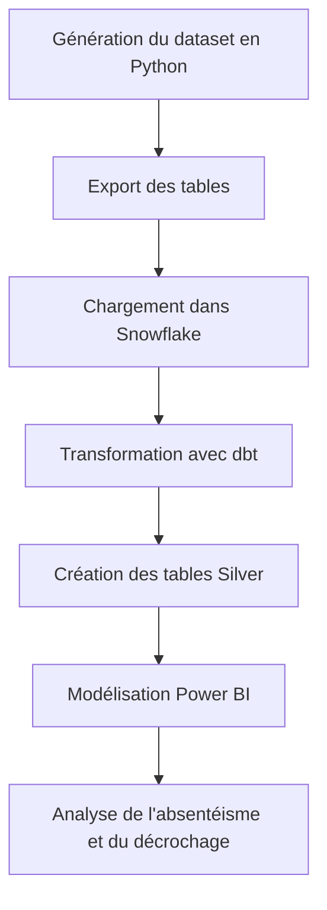

# Projet d'analyse de l'absentéisme au lycée

Ce projet simule un environnement analytique autour de l'absentéisme scolaire dans des lycées marocains. L'objectif est d'expliquer pourquoi les élèves s'absentent, d'identifier les facteurs de risque et de construire une base propre pour l'analyse dans Power BI.

Le projet a été pensé comme un vrai travail de data analyst et de data engineer: génération des données, structuration du pipeline, transformation, modélisation analytique et restitution visuelle.

## Vision métier

L'analyse cherche à répondre à des questions concrètes:

- quels élèves ou classes présentent le plus fort risque d'absentéisme
- quelles régions montrent des écarts de présence et de performance
- comment les absences influencent les notes et le risque de décrochage
- quelles tendances saisonnières apparaissent dans les absences

## Architecture du projet

Le projet suit une logique Bronze / Silver, adaptée à une architecture analytique moderne.

### Rôle de chaque couche

- Bronze: conservation des données brutes, traçables et réutilisables
- dbt: transformation SQL, contrôle qualité, normalisation des métriques
- Silver: tables prêtes à analyser avec une structure claire
- Power BI: visualisation, suivi des KPI et exploration métier

## Pipeline de travail

## Ce que contient le projet

- `generate_education_lycee_dataset.py`: script Python qui génère les données simulées
- `data_raw/`: dossier des fichiers produits par le script
- fichiers `.pbix`: rapports Power BI liés au projet

## Données produites

Le script génère plusieurs tables pour couvrir le cycle analytique:

- régions
- établissements
- classes
- élèves
- enseignants
- matières
- calendrier
- notes
- présences
- métriques élèves

Cette structure permet d'analyser les absences, les résultats scolaires et les disparités territoriales dans une logique proche d'un entrepôt de données.

## Méthode d'analyse

Le projet se place à la frontière entre analyse métier et ingénierie data:

- compréhension du contexte scolaire
- création d'un dataset exploitable pour le reporting
- structuration de la donnée pour Snowflake
- transformations dbt pour fiabiliser les tables d'analyse
- préparation des indicateurs pour Power BI

## Ce que j'ai cherché à démontrer

- une chaîne de données propre et cohérente
- une architecture Bronze / Silver claire
- une logique d'analyse orientée décision
- une préparation adaptée au reporting et au monitoring
- une lecture simple du phénomène d'absentéisme

## Exemples d'indicateurs utiles

- taux d'absentéisme par région
- taux d'absences justifiées et non justifiées
- note moyenne par classe et par matière
- niveau de risque de décrochage
- évolution saisonnière des absences

## Stack utilisée

- Python
- pandas
- numpy
- Snowflake
- dbt
- Power BI

## Comment utiliser le projet

1. Exécuter `generate_education_lycee_dataset.py`
2. Charger les données générées dans Snowflake
3. Appliquer les transformations dbt pour construire la couche Silver
4. Connecter Power BI aux tables préparées
5. Construire les visuels et les KPI d'absentéisme

## Lecture rapide

Si vous voulez comprendre le projet en quelques minutes, commencez par:

1. ce README
2. le script de génération des données
3. les rapports Power BI

## Note sur les schémas

Les blocs Mermaid ci-dessus servent de schémas intégrés directement dans le README. Sur GitHub, ils s'affichent comme des visuels et remplacent avantageusement des images statiques quand on veut documenter un pipeline analytique.
