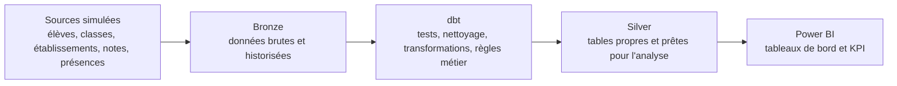
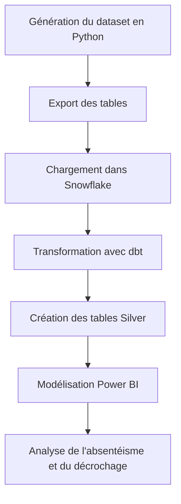
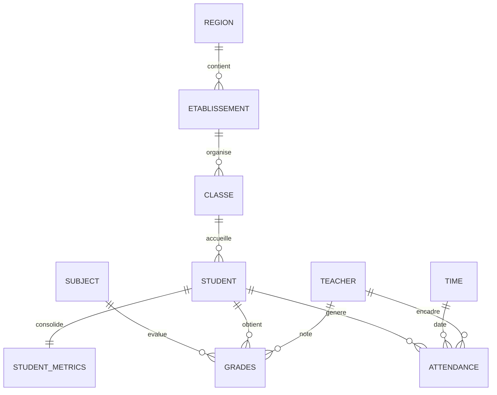
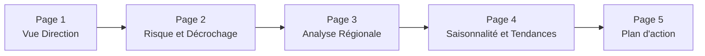
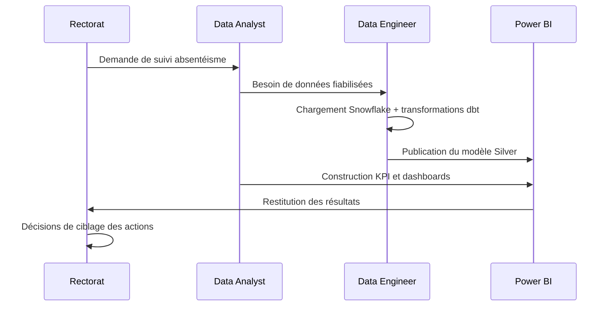
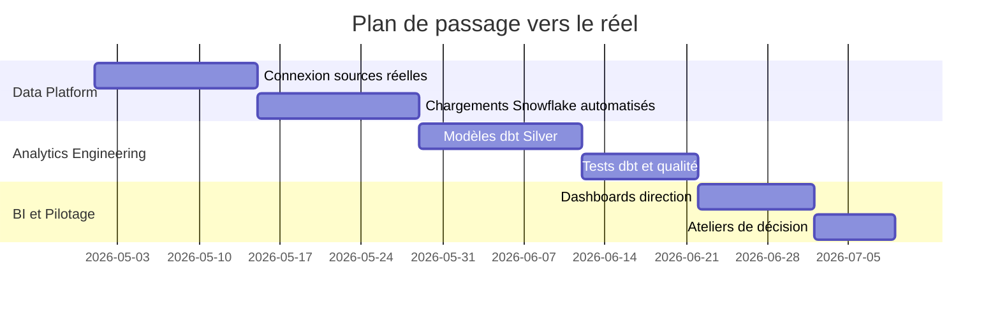

# Projet d'analyse de l'absentéisme au lycée

## Résumé exécutif

Ce dépôt présente un projet complet de data analytics appliqué à l'absentéisme scolaire. L'approche relie la donnée brute aux décisions terrain: détection des élèves à risque, priorisation des actions par région et pilotage des performances via Power BI.

Objectif de valeur: fournir à une direction académique un socle analytique fiable pour agir vite, cibler les efforts et réduire le décrochage.

Ce projet simule un environnement analytique autour de l'absentéisme scolaire dans des lycées marocains. L'objectif est d'expliquer pourquoi les élèves s'absentent, d'identifier les facteurs de risque et de construire une base propre pour l'analyse dans Power BI.

Le projet a été pensé comme un vrai travail de data analyst et de data engineer: génération des données, structuration du pipeline, transformation, modélisation analytique et restitution visuelle.

## Vision métier

L'analyse cherche à répondre à des questions concrètes:

- quels élèves ou classes présentent le plus fort risque d'absentéisme
- quelles régions montrent des écarts de présence et de performance
- comment les absences influencent les notes et le risque de décrochage
- quelles tendances saisonnières apparaissent dans les absences

## Architecture du projet

Le projet suit une logique Bronze / Silver, adaptée à une architecture analytique moderne.

### Rôle de chaque couche

- Bronze: conservation des données brutes, traçables et réutilisables
- dbt: transformation SQL, contrôle qualité, normalisation des métriques
- Silver: tables prêtes à analyser avec une structure claire
- Power BI: visualisation, suivi des KPI et exploration métier

## Pipeline de travail

## Modèle de données analytique

Ce schéma montre la logique étoile utilisée pour l'analyse: dimensions stables et tables de faits centrées sur les notes et les présences.

## Storyboard Power BI

## Parcours décisionnel rectorat

## Roadmap de mise en production

## Ce que contient le projet

- `generate_education_lycee_dataset.py`: script Python qui génère les données simulées
- `data_raw/`: dossier des fichiers produits par le script
- fichiers `.pbix`: rapports Power BI liés au projet

## Données produites

Le script génère plusieurs tables pour couvrir le cycle analytique:

- régions
- établissements
- classes
- élèves
- enseignants
- matières
- calendrier
- notes
- présences
- métriques élèves

Cette structure permet d'analyser les absences, les résultats scolaires et les disparités territoriales dans une logique proche d'un entrepôt de données.

## Méthode d'analyse

Le projet se place à la frontière entre analyse métier et ingénierie data:

- compréhension du contexte scolaire
- création d'un dataset exploitable pour le reporting
- structuration de la donnée pour Snowflake
- transformations dbt pour fiabiliser les tables d'analyse
- préparation des indicateurs pour Power BI

## Résultats métier attendus

Le dispositif analytique permet de passer de la description à l'action:

- identifier les établissements où l'absentéisme non justifié est le plus critique
- repérer en amont les profils à risque de décrochage
- cibler les interventions pédagogiques et sociales par zone
- suivre l'efficacité des actions correctives dans le temps

Exemples de décisions rendues possibles:

- renforcer le suivi individualisé sur les classes les plus exposées
- ajuster les actions de prévention avant les périodes saisonnières à risque
- prioriser les ressources éducatives sur les établissements les plus vulnérables

## Qualité et fiabilité des données

Le projet met l'accent sur la qualité de la donnée pour assurer des décisions robustes:

- séparation claire des couches Bronze et Silver
- standardisation des indicateurs clés avant consommation BI
- transformations reproductibles via dbt
- base prête pour des contrôles additionnels (tests de complétude, cohérence, unicité)

## Ce que j'ai cherché à démontrer

- une chaîne de données propre et cohérente
- une architecture Bronze / Silver claire
- une logique d'analyse orientée décision
- une préparation adaptée au reporting et au monitoring
- une lecture simple du phénomène d'absentéisme

## Compétences démontrées

- Data engineering: structuration de pipeline et modélisation en couches
- Analytics engineering: transformations métier avec dbt
- Data analysis: définition et interprétation des KPI d'absentéisme
- BI: conception de tableaux de bord orientés décision
- Vision produit data: alignement des indicateurs avec les besoins d'une direction

## Exemples d'indicateurs utiles

- taux d'absentéisme par région
- taux d'absences justifiées et non justifiées
- note moyenne par classe et par matière
- niveau de risque de décrochage
- évolution saisonnière des absences

## Plan d'industrialisation

Pour un passage en environnement réel, l'étape suivante est claire:

1. brancher des sources opérationnelles réelles
2. automatiser les chargements Snowflake
3. renforcer les tests dbt (qualité et régression)
4. publier des tableaux de bord avec suivi périodique
5. instaurer une gouvernance des indicateurs avec les équipes académiques

## Pourquoi ce projet est prêt pour un recruteur

Ce travail montre une capacité à livrer une chaîne analytique de bout en bout, avec une double maîtrise technique et métier. Il ne s'arrête pas à des graphiques: il structure la donnée pour soutenir des décisions concrètes sur la réussite scolaire.

## Stack utilisée

- Python
- pandas
- numpy
- Snowflake
- dbt
- Power BI

## Comment utiliser le projet

1. Exécuter `generate_education_lycee_dataset.py`
2. Charger les données générées dans Snowflake
3. Appliquer les transformations dbt pour construire la couche Silver
4. Connecter Power BI aux tables préparées
5. Construire les visuels et les KPI d'absentéisme

## Lecture rapide

Si vous voulez comprendre le projet en quelques minutes, commencez par:

1. ce README
2. le script de génération des données
3. les rapports Power BI

## Note sur les schémas

Les blocs Mermaid ci-dessus servent de schémas intégrés directement dans le README. Sur GitHub, ils s'affichent comme des visuels et remplacent avantageusement des images statiques quand on veut documenter un pipeline analytique.
